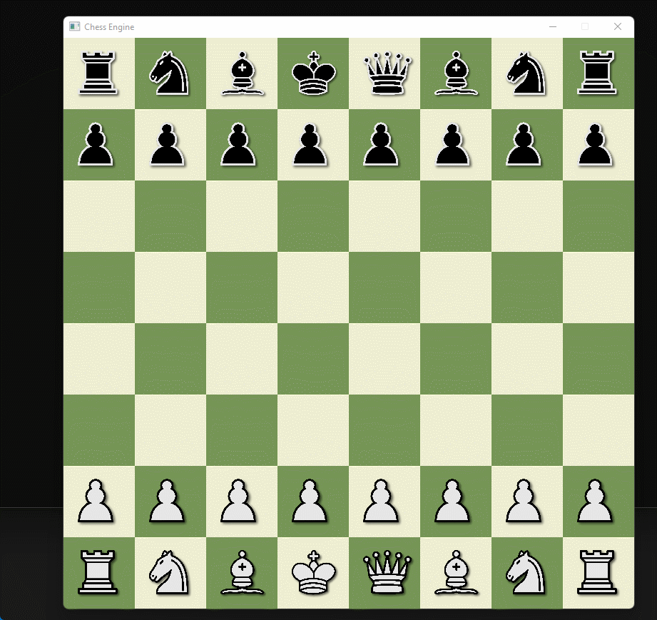
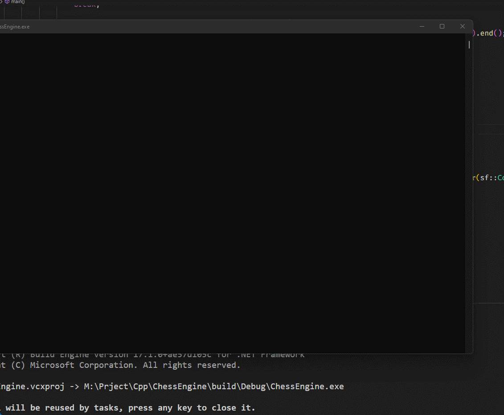
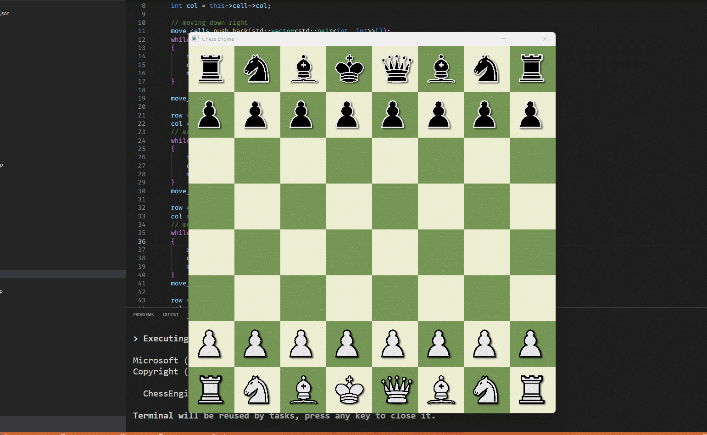

# ChessEngine
ChessEngine using C++ and SFML

UNDER CONSTRUCTION

After some time of development ... 

After some time of development again ... 

After some time of development again ... and again 

HOW TO BULILD

      cd build
      cmake --build .
      
